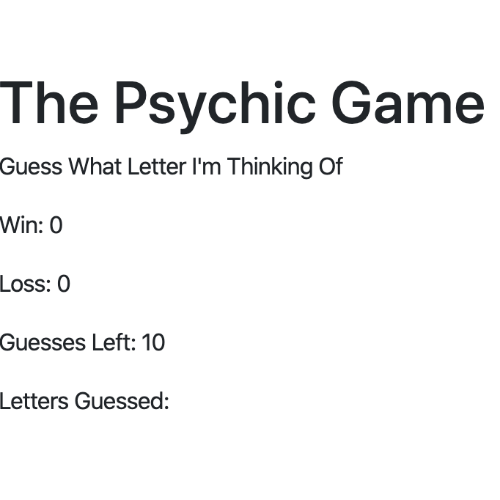

# Psychic-Game
Simple letter guess game. Interactive web app, dynamically updated HTML & CSS based on javascript.

### How to Play
Type any letter to begin. You have 10 tries to guess what letter the computer is *thinking* of. When you win or lose, your score is updated.  This is a never ending game.

## Built With 
* html
* Javascript

## Versioning & Author
This is the only version and is maintained by me, [sabomade](https://github.com/sabomade).

## Acknowledgements
Built & completed as part of the UCB Coding Bootcamp, Homework 3: Javascript
